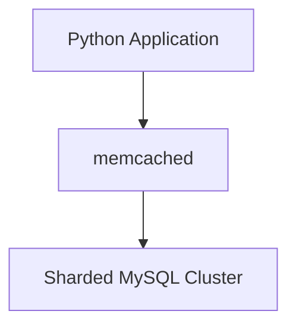

# Hulu MySQL memcached platform (2012)

Sharded RDBMS cached by memcached with consistent hashing.

## Design goals

- early scale out in a single location

## Limitations

- single datacenter only, as it was impossible to replicate the memcached instance
- lacking performance

## Stack 

- MySQL
- Python
- memcached

## References

- \[1] https://content.pivotal.io/blog/case-study-how-hulu-scaled-serving-4-billion-videos-using-redis

