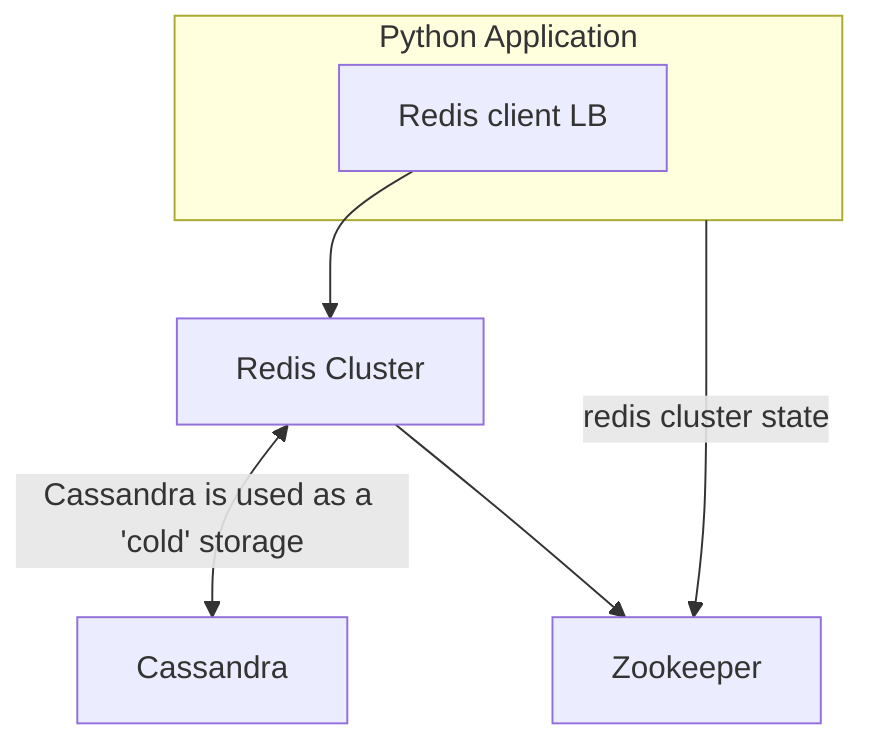

# Hulu Redis Multi-DC (2013)

After evaluating MongoDB, Riak and LevelDB, Hulu went for Redis especially for hset/hget and hgetall types of data access. 
As Redis sentinel did not exist back then Hulu build a Zookeeper based client load-balancing. To optimize Redis CPU usages 
Hulu ran 16 Redis instances per host. To avoid disk stalls on "BGSAVE" disk writing is disabled and done nightly by cron.

# Design goals

- faster write/reads, lower latency
- cross data center replication
- 10k queries/s
- HA for the NoSQL part

## Limitations

- no sentinel at that time -> own solution had to be build

## Sizing

- max-requests: 10k/s
- max-storage: 4 billion records
   
## Stack

- Python
- Redis
- Zookeeper
- Cassandra

## References
- \[1] https://content.pivotal.io/blog/case-study-how-hulu-scaled-serving-4-billion-videos-using-redis

