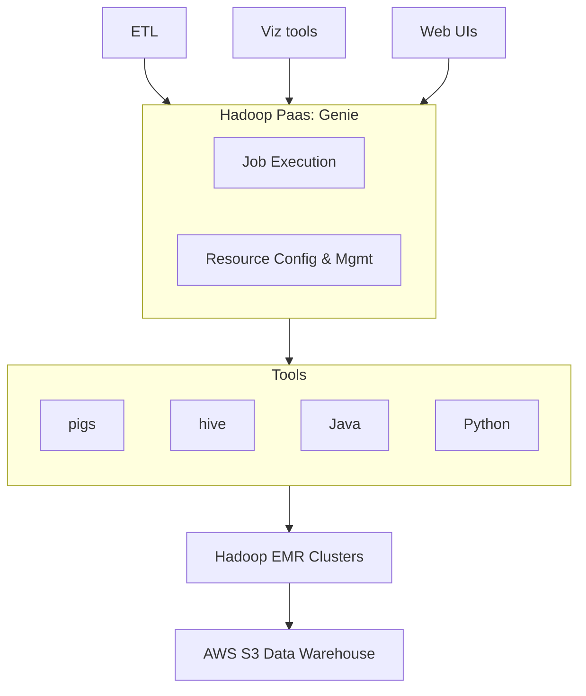

# Genie Hadoop PaaS (2013)

## Design goals
   - simple job interface needed for clients that do not have Hadoop installed
   - horizontal scalability
   - abstract multi-clusters, provide one backend interface

## Sizing

Company blog \[1]:
- "petabyte-scale"
- "large 500+ nodes query cluster"
- cluster-setup-time: 10min

## Limitations

Company blog \[2]:
- only Hadoop 1.x
- fixed data model
- no good criteria to select execution cluster

## Stack

- Hadoop
- EMR
- Genie
- ETL
- Ursula
- Aegisthus
- Cassandra
- S3
- Hive
- Pig
- Teradata
- Eureka

Hosting:

- AWS

## References

- \[1] [https://medium.com/netflix-techblog/hadoop-platform-as-a-service-in-the-cloud-c23f35f965e7](https://medium.com/netflix-techblog/hadoop-platform-as-a-service-in-the-cloud-c23f35f965e7)
- \[2] [https://medium.com/netflix-techblog/genie-2-0-second-wish-granted-d888d79455c6](https://medium.com/netflix-techblog/genie-2-0-second-wish-granted-d888d79455c6)
