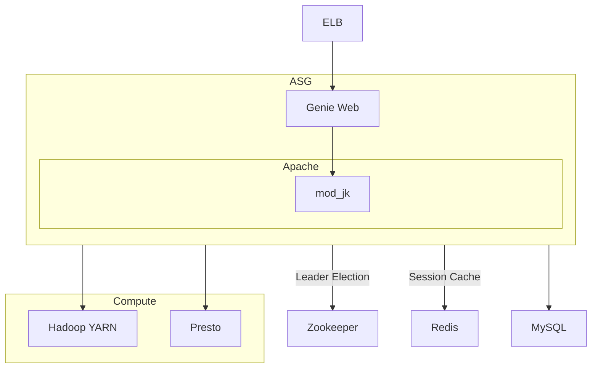

# Data Platform with Genie3 (2017)

## Design goals

- flexible exection engine
- pluggable task types
- dedicated infrastructure nodes with leader election
- Build-in security
- Dependency cache

## Limitations

- users still have to poll for results
- jobs run on the same node
- missing open source API
- full text search jobs missing

## Sizing

- max jobs: 150000/day
- max concurrent jobs: 700

## Stack

- Spark
- Redshift
- S3
- druid
- Presto
- Hive
- Genie
- Metacat
- Apache
- YARN
- Redis
- Zookeeper

## References

- \[1] https://medium.com/netflix-techblog/evolving-the-netflix-data-platform-with-genie-3-598021604dda
- \[2] https://www.youtube.com/watch?v=CSDIThSwA7s
- \[3] https://cdn-images-1.medium.com/max/800/0*D6TjU22i2ehz5MHy.
