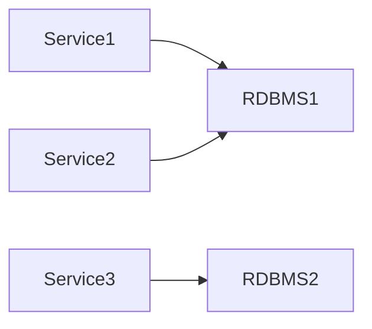

# RDBMS (2014)

Standalone traditional OLTP databases without global view over all data.

## Sizing

- max storage: 10TB
- max latency: 60s

## Stack

- Postgres
- MySQL

## References

- \[1] https://eng.uber.com/uber-big-data-platform/
- \[2] https://1fykyq3mdn5r21tpna3wkdyi-wpengine.netdna-ssl.com/wp-content/uploads/2018/10/image4.png

