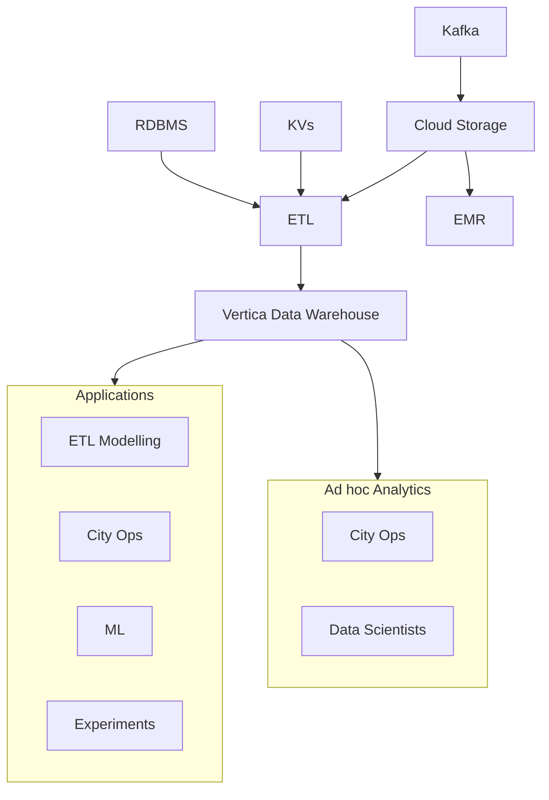

# DWH Data Lake (2015)

DWH to aggregate all Ubers data in one place providing an SQL interface.

## Limitations

- problems JSON format
- non-change-resilient ingestion
- lack of formal schema communication
- expensive to scale
- hard to scale horizontally

## Sizing

Company blog \[1] says
- max storage ~10s TB
- max latency 24-48h
- max users: "several hundreds"

## Stack

- Vertica
- ETL
- Kafka
- Sharded Key Value Stores

## References

- \[1] https://eng.uber.com/uber-big-data-platform/
- \[2] https://1fykyq3mdn5r21tpna3wkdyi-wpengine.netdna-ssl.com/wp-content/uploads/2018/10/image2-1.png
