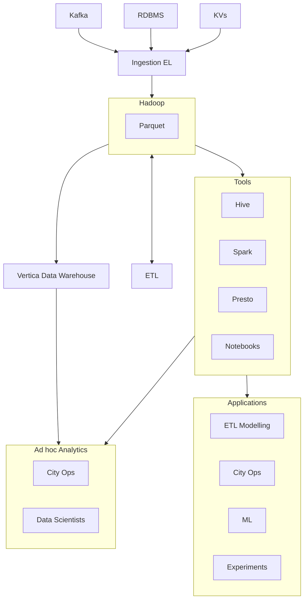

# Hadoop Data Lake (2016)

Leverages Hadoop to enable horizontal scaling.

## Limitations

- HDFS NameNode load
- still high latency
- handling historical data
- HDFS/Parquet don't support updating data

## Sizing

- max storage: 10PB
- max latency: 24h
- max cores: 10000 vcores
- max jobs: 100000/day

## Stack

- Hadoop
- Parquet
- ETL
- Kafka
- Sharded KV
- Hive
- Spark
- Presto
- Vertica

## References
- \1 https://eng.uber.com/uber-big-data-platform/
- \2 https://1fykyq3mdn5r21tpna3wkdyi-wpengine.netdna-ssl.com/wp-content/uploads/2018/10/image8.png
