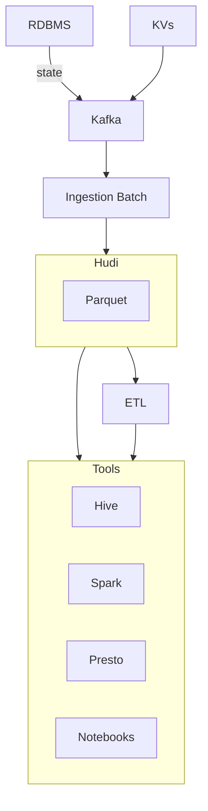

# Big Data Platform (2017)

Incremental data ingestion using Marmaray, more efficient
storage using Hudi library. Unified Avro encoding with
standard global metadata headets in a generic ingest pipeline.

## Limitations

- latency should be lower
- dedicated hardware
- scheduling Hadoop and non-Hadoop services
- fragile ingest pipeline

## Sizing

- max storage: 100PB
- max-latency: 1h

## Stack

- Hadoop
- Parquet
- ETL
- Kafka
- Sharded KV
- Hive
- Spark
- Presto
- Hudi
- Marmaray

## References

- \[1] https://eng.uber.com/uber-big-data-platform/
- \[2] https://1fykyq3mdn5r21tpna3wkdyi-wpengine.netdna-ssl.com/wp-content/uploads/2018/10/image1-1-696x383.png
