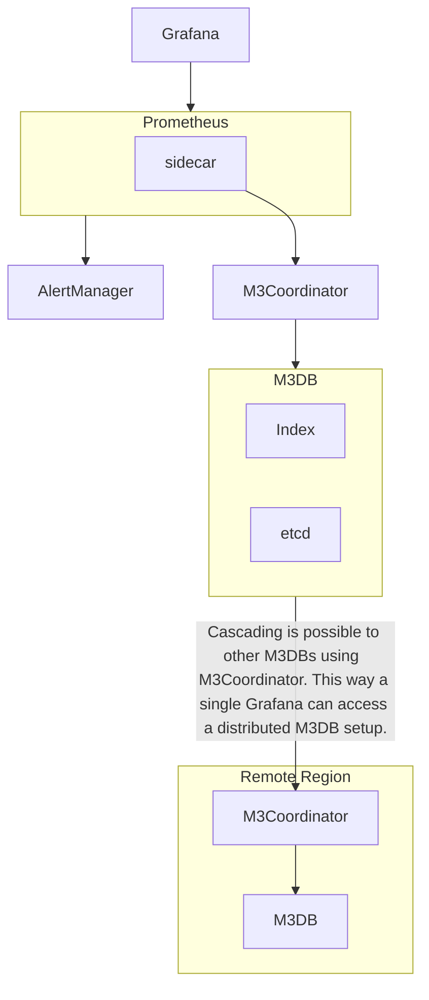

# Monitoring with M3 (2018)

Distributed Prometheus and Graphite compatible metrics database
using an improved TSZ compression variant. For performance reasons
downsampling happens at collection time as per user-defined rules.

  
## Sizing

- max-storage: 100PB
- max-metrics: 6.600.000.000
- max-metrics-aggregated-per-second: 500.000.000
- max-metrics-stored-per-second: 20.000.000
- retention-granularity: "30d at 10s, 5y at 1h"
   
## Stack

- M3DB
- M3Coordinator
- Prometheus
- Grafana
- etcd
- Prometheus node_exporter

## References

- \[1] https://eng.uber.com/m3/
- \[2] http://1fykyq3mdn5r21tpna3wkdyi-wpengine.netdna-ssl.com/wp-content/uploads/2018/08/image4-1.png
- \[3] http://schd.ws/hosted_files/cloudnativeeu2017/73/Integrating%20Long-Term%20Storage%20with%20Prometheus%20-%20CloudNativeCon%20Berlin%2C%20March%2030%2C%202017.pdf
